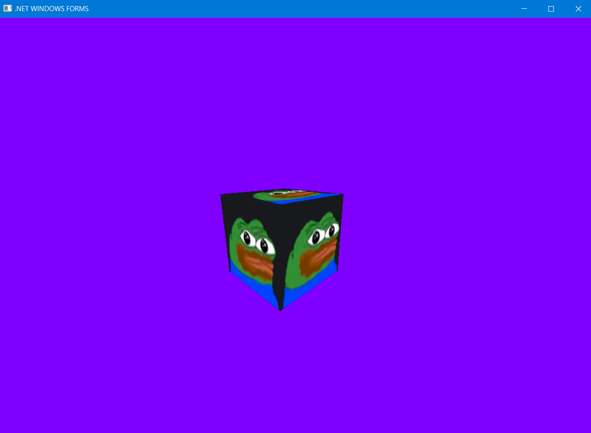

# OPENGL PART 3 with textures

### Main requerement: https://github.com/microsoft/vcpkg
**Install the necessary dependencies listed in the README of this repository**
- ##### freeglut
- ##### glew
- ##### glm
- ##### ImageMagick (Magick++ for C++)

### What's New
- ##### Added texture to a shape (custom look)

### Code
> Texture class
> Implementation of the methods is in the file Texture.cpp 
```c++
using namespace Magick;

class Texture {
public:
    Texture(GLenum TextureTarget, const std::string& FileName);
    bool Load();
    void Bind(GLenum TextureUnit);

private:
    std::string fileName;
    GLenum textureTarget;
    GLuint textureObj;
    Image* image;
    Blob blob;
};
```

> Updating the vertex and fragment shader at "Strings.h"
```c++
// vertex shader
static const char* pVS = "                                                          \n\
#version 330                                                                        \n\
                                                                                    \n\
layout (location = 0) in vec3 Position;                                             \n\
layout (location = 1) in vec2 TexCoord;                                             \n\
                                                                                    \n\
uniform mat4 gWVP;                                                                  \n\
                                                                                    \n\
out vec2 TexCoord0;                                                                 \n\
                                                                                    \n\
void main()                                                                         \n\
{                                                                                   \n\
    gl_Position = gWVP * vec4(Position, 1.0);                                       \n\
    TexCoord0 = TexCoord;                                                           \n\
}";

// fragment shader
static const char* pFS = "                                                          \n\
#version 330                                                                        \n\
                                                                                    \n\
in vec2 TexCoord0;                                                                  \n\
                                                                                    \n\
out vec4 FragColor;                                                                 \n\
                                                                                    \n\
uniform sampler2D gSampler;                                                         \n\
                                                                                    \n\
void main()                                                                         \n\
{                                                                                   \n\
    FragColor = texture2D(gSampler, TexCoord0.xy);                                  \n\
}";
```

> Сhanges at executable file

- Global variables
```c++
GLuint Sampler;
Texture* texture = NULL;
```

- Description of the Vertex structure to bind each vertex to a picture coordinate
```c++
struct Vertex
{
    glm::vec3 m_pos;
    glm::vec2 m_tex;

    Vertex() {}

    Vertex(glm::vec3 pos, glm::vec2 tex)
    {
        m_pos = pos;
        m_tex = tex;
    }
};
```

- Update the vertex buffer function
```c++
Vertex Vertices[24] = {
        Vertex(Vector3f(-0.25f, 0.25f, 0.25f), Vector2f(0.0f, 0.0f)),
        Vertex(Vector3f(0.25f, 0.25f, 0.25f), Vector2f(1.0f, 0.0f)),
        Vertex(Vector3f(-0.25f, -0.25f, 0.25f), Vector2f(0.0f, 1.0f)),
        Vertex(Vector3f(0.25f, -0.25f, 0.25f), Vector2f(1.0f, 1.0f)),

        Vertex(Vector3f(0.25f, 0.25f, 0.25f), Vector2f(0.0f, 0.0f)),
        Vertex(Vector3f(0.25f, 0.25f, -0.25f), Vector2f(1.0f, 0.0f)),
        Vertex(Vector3f(0.25f, -0.25f, 0.25f), Vector2f(0.0f, 1.0f)),
        Vertex(Vector3f(0.25f, -0.25f, -0.25f), Vector2f(1.0f, 1.0f)),

        Vertex(Vector3f(0.25f, 0.25f, -0.25f), Vector2f(0.0f, 0.0f)),
        Vertex(Vector3f(-0.25f, 0.25f, -0.25f), Vector2f(1.0f, 0.0f)),
        Vertex(Vector3f(0.25f, -0.25f, -0.25f), Vector2f(0.0f, 1.0f)),
        Vertex(Vector3f(-0.25f, -0.25f, -0.25f), Vector2f(1.0f, 1.0f)),

        Vertex(Vector3f(-0.25f, 0.25f, -0.25f), Vector2f(0.0f, 0.0f)),
        Vertex(Vector3f(-0.25f, 0.25f, 0.25f), Vector2f(1.0f, 0.0f)),
        Vertex(Vector3f(-0.25f, -0.25f, -0.25f), Vector2f(0.0f, 1.0f)),
        Vertex(Vector3f(-0.25f, -0.25f, 0.25f), Vector2f(1.0f, 1.0f)),

        Vertex(Vector3f(-0.25f, 0.25f, -0.25f), Vector2f(0.0f, 0.0f)),
        Vertex(Vector3f(0.25f, 0.25f, -0.25f), Vector2f(1.0f, 0.0f)),
        Vertex(Vector3f(-0.25f, 0.25f, 0.25f), Vector2f(0.0f, 1.0f)),
        Vertex(Vector3f(0.25f, 0.25f, 0.25f),Vector2f(1.0f, 1.0f)),

        Vertex(Vector3f(-0.25f, -0.25f, 0.25f), Vector2f(0.0f, 0.0f)),
        Vertex(Vector3f(0.25f, -0.25f, 0.25f), Vector2f(1.0f, 0.0f)),
        Vertex(Vector3f(-0.25f, -0.25f, -0.25f), Vector2f(0.0f, 1.0f)),
        Vertex(Vector3f(0.25f, -0.25f, -0.25f), Vector2f(1.0f, 1.0f)),
    };
```

- Render function (only changes)
```c++
    // Bind the buffer for drawing
    glBindBuffer(GL_ARRAY_BUFFER, VerticlesBuffer);
    // Set vertex attributes
    glVertexAttribPointer(0, 3, GL_FLOAT, GL_FALSE, sizeof(Vertex), 0);
    glVertexAttribPointer(1, 2, GL_FLOAT, GL_FALSE, sizeof(Vertex), (const GLvoid*)12);
    // Bind the index buffer for drawing
    glBindBuffer(GL_ELEMENT_ARRAY_BUFFER, IndexBuffer); 
    // Set textures
    texture->Bind(GL_TEXTURE0);
    // Drawing the vertices of the cube
    glDrawElements(GL_TRIANGLES, 36, GL_UNSIGNED_INT, 0);
```

- CompileShaders function (only changes)
```c++
    // save to the gWorldLocation variable
    gWorldLocation = glGetUniformLocation(ShaderProgram, "gWVP");
    assert(gWorldLocation != 0xFFFFFFFFFF);
    Sampler = glGetUniformLocation(ShaderProgram, "gSampler");
    assert(Sampler != 0xFFFFFFFFFF);
```

- Main function (only changes)
```c++
    // Texture Optimization
    glFrontFace(GL_CW);
    glCullFace(GL_BACK);
    glEnable(GL_CULL_FACE);
    
    // Set texture indices for later use within shaders
    glUniform1i(Sampler, 0);
    
    // Shader init
    texture = new Texture(GL_TEXTURE_2D, "img\\pepe.jpg");
    if (!texture->Load())
        return 1;
```

### Working demo


