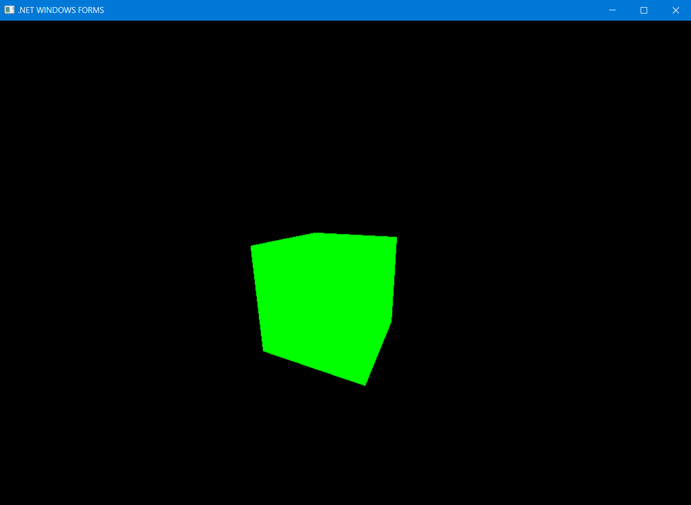

# OPENGL PART 3

### Main requerement: https://github.com/microsoft/vcpkg
**Install the necessary dependencies listed in the README of this repository**
- ##### freeglut
- ##### glew
- ##### glm

### What's New
- ##### Added the ability to move the camera
- ##### Work with volumetric (three-dimensional) figure
- ##### Setting callback functions to handle keystrokes and mouse movements   

### Code
> Camera class
> Implementation of the methods is in the file camera.cpp    
```c++
    class Camera {
        void Init();
        void Update();
    
        Vector3f pos;
        Vector3f target;
        Vector3f up;
    
        int windowWidth;
        int windowHeight;
    
        float AngleH;
        float AngleV;
    
        bool OnUpperEdge;
        bool OnLowerEdge;
        bool OnLeftEdge;
        bool OnRightEdge;
    
        Vector2i mousePos;
    
    public:
        Camera(int WindowWidth, int WindowHeight);
        Camera(int WindowWidth, int WindowHeight, const Vector3f& Pos, const Vector3f& Target, const Vector3f& Up);
    
        bool OnKeyboard(int Key);
        void OnMouse(int x, int y);
        void OnRender();
    
        const Vector3f& GetPos() const { return pos; }
        const Vector3f& GetTarget() const { return target; }
        const Vector3f& GetUp() const { return up; }
    };
```

> Pipeline class was compiled by putting methods related to specific fields 
```c++
    glm::vec3 scale;
    glm::vec3 worldPos;
    glm::vec3 rotateInfo;
    glm::mat4 transformation;
```

> into separate structures
```c++
    struct Vector3f {
    float x, y, z;

    Vector3f() {}

    Vector3f(float x, float y, float z) {
        (*this).x = x;
        (*this).y = y;
        (*this).z = z;
    }

    Vector3f& operator+=(const Vector3f& r) {
        x += r.x;
        y += r.y;
        z += r.z;
        return *this;
    }

    Vector3f& operator-=(const Vector3f& r) {
        x -= r.x;
        y -= r.y;
        z -= r.z;
        return *this;
    }

    Vector3f& operator*=(float f) {
        x *= f;
        y *= f;
        z *= f;
        return *this;
    }

    Vector3f Cross(const Vector3f& v) const;

    Vector3f& Normalize();

    void Rotate(float Angle, const Vector3f& Axis);

    void Print() const { printf("(%.02f, %.02f, %.02f", x, y, z); }
};

inline Vector3f operator+(const Vector3f& l, const Vector3f& r) {
    Vector3f Ret(
        l.x + r.x,
        l.y + r.y,
        l.z + r.z
    );
    return Ret;
}

inline Vector3f operator-(const Vector3f& l, const Vector3f& r) {
    Vector3f Ret(
        l.x - r.x,
        l.y - r.y,
        l.z - r.z
    );
    return Ret;
}

inline Vector3f operator*(const Vector3f& l, float f) {
    Vector3f Ret(
        l.x * f,
        l.y * f,
        l.z * f
    );
    return Ret;
}
```

AND

```c++
class Matrix4f {
public:
    float m[4][4];

    Matrix4f() {}

    inline void InitIdentity() {
        m[0][0] = 1.0f; m[0][1] = 0.0f; m[0][2] = 0.0f; m[0][3] = 0.0f;
        m[1][0] = 0.0f; m[1][1] = 1.0f; m[1][2] = 0.0f; m[1][3] = 0.0f;
        m[2][0] = 0.0f; m[2][1] = 0.0f; m[2][2] = 1.0f; m[2][3] = 0.0f;
        m[3][0] = 0.0f; m[3][1] = 0.0f; m[3][2] = 0.0f; m[3][3] = 1.0f;
    }

    inline Matrix4f operator*(const Matrix4f& Right) const {
        Matrix4f Ret;

        for (unsigned int i = 0; i < 4; i++) {
            for (unsigned int j = 0; j < 4; j++) {
                Ret.m[i][j] = m[i][0] * Right.m[0][j] +
                    m[i][1] * Right.m[1][j] +
                    m[i][2] * Right.m[2][j] +
                    m[i][3] * Right.m[3][j];
            }
        }
        return Ret;
    }

    void InitScaleTransform(float ScaleX, float ScaleY, float ScaleZ);
    void InitRotateTransform(float RotateX, float RotateY, float RotateZ);
    void InitTranslationTransform(float x, float y, float z);
    void InitCameraTransform(const Vector3f& Target, const Vector3f& Up);
    void InitPersProjTransform(float FOV, float Width, float Height, float zNear, float zFar);
};
```

> Refactoring Pipeling class

```c++
    const Matrix4f* Pipeline::getTransformation() {
        Matrix4f ScaleTrans, 
        RotateTrans, 
        TranslationTrans, 
        CameraTranslationTrans, 
        CameraRotateTrans, 
        PersProjTrans;
    
        ScaleTrans.InitScaleTransform(scale.x, scale.y, scale.z);
        RotateTrans.InitRotateTransform(rotateInfo.x, rotateInfo.y, rotateInfo.z);
        TranslationTrans.InitTranslationTransform(worldPos.x, worldPos.y, worldPos.z);
        CameraTranslationTrans.InitTranslationTransform(-camera.Pos.x, -camera.Pos.y, -camera.Pos.z);
        CameraRotateTrans.InitCameraTransform(camera.Target, camera.Up);
        PersProjTrans.InitPersProjTransform(persProj.FOV, persProj.Width, persProj.Height, persProj.zNear, persProj.zFar);
    
        transformation = PersProjTrans * CameraRotateTrans * CameraTranslationTrans * TranslationTrans * RotateTrans * ScaleTrans;
        return &transformation;
    }
```

> Vertex shader and the fragment shader were put in a separate header file "Strings.h"
```c++
    static const char* pVS = "                                                          \n\
    #version 330                                                                        \n\
                                                                                        \n\
    layout (location = 0) in vec3 Position;                                             \n\
                                                                                        \n\
    uniform mat4 gWorld;                                                                \n\
                                                                                        \n\
    void main()                                                                         \n\
    {                                                                                   \n\
        gl_Position = gWorld * vec4(Position, 1.0);                                     \n\
    }";
    
    static const char* pFS = "                                                          \n\
    #version 330                                                                        \n\
                                                                                        \n\
    out vec4 FragColor;                                                                 \n\
                                                                                        \n\
    void main()                                                                         \n\
    {                                                                                   \n\
        FragColor = vec4(0.0, 1.0, 0.0, 1.0);                                           \n\
    }";
```

> Сhanges at executable file

- ##### Global variables
```c++
    GLuint IndexBuffer;
    Camera* camera = NULL;
    bool pause = false;
```

- ##### Callback functions to handle keystrokes and mouse movements
```c++
    // camera movement by mouse
    static void SpecialKeyboardCB(int Key, int x, int y) {
        camera->OnKeyboard(Key);
    }
     // hotkeys for quit from programm and stop scaling shaders
    static void KeyboardCB(unsigned char Key, int x, int y) {
        switch (Key) {
        case 'q':
            exit(0);
        case 'p':
            if (pause) pause = false;
            else pause = true;
            break;
        }
    }
    // camera movement by mouse
    static void PassiveMouseCB(int x, int y) {
        camera->OnMouse(x, y);
    }
```
 
- ##### Vertex buffering function
```c++
      static void CreateVertexBuffer() {   
      // crystall
      Vector3f Vertices[10] = {
          Vector3f(0.125f, 0.0f, -0.0625f),
          Vector3f(-0.125f, 0.0f, -0.0625f),
          Vector3f(-0.125f, 0.0f, 0.0625f),
          Vector3f(0.125f, 0.0f, 0.0625f),

          Vector3f(0.0625f, 0.0f, -0.125f),
          Vector3f(-0.0625f, 0.0f, -0.125f),
          Vector3f(-0.0625f, 0.0f, 0.125f),
          Vector3f(0.0625f, 0.0f, 0.125f),

          Vector3f(0.0f, 0.5f, 0.0f),
          Vector3f(0.0f, -0.5f, 0.0f),
      };

      // Cube
      //Vector3f Vertices[24] = {
      //    Vector3f(-0.25f, 0.25f, 0.25f),
      //    Vector3f(0.25f, 0.25f, 0.25f),
      //    Vector3f(-0.25f, -0.25f, 0.25f),
      //    Vector3f(0.25f, -0.25f, 0.25f),

      //    Vector3f(0.25f, 0.25f, 0.25f),
      //    Vector3f(0.25f, 0.25f, -0.25f),
      //    Vector3f(0.25f, -0.25f, 0.25f),
      //    Vector3f(0.25f, -0.25f, -0.25f),
      //    
      //    Vector3f(0.25f, 0.25f, -0.25f),
      //    Vector3f(-0.25f, 0.25f, -0.25f),
      //    Vector3f(0.25f, -0.25f, -0.25f),
      //    Vector3f(-0.25f, -0.25f, -0.25f),

      //    Vector3f(-0.25f, 0.25f, -0.25f),
      //    Vector3f(-0.25f, 0.25f, 0.25f),
      //    Vector3f(-0.25f, -0.25f, -0.25f),
      //    Vector3f(-0.25f, -0.25f, 0.25f),

      //    Vector3f(-0.25f, 0.25f, -0.25f),
      //    Vector3f(0.25f, 0.25f, -0.25f),
      //    Vector3f(-0.25f, 0.25f, 0.25f),
      //    Vector3f(0.25f, 0.25f, 0.25f),

      //    Vector3f(-0.25f, -0.25f, 0.25f),
      //    Vector3f(0.25f, -0.25f, 0.25f),
      //    Vector3f(-0.25f, -0.25f, -0.25f),
      //    Vector3f(0.25f, -0.25f, -0.25f),
      //};

      glGenBuffers(1, &VerticlesBuffer);
      glBindBuffer(GL_ARRAY_BUFFER, VerticlesBuffer);
      glBufferData(GL_ARRAY_BUFFER, sizeof(Vertices), Vertices, GL_STATIC_DRAW);
  }
```

- ##### Index buffering function
```c++
    static void CreateIndexBuffer() {
    // Октаэдр
      unsigned int Indices[] = {
        5, 4, 8,
        4, 0, 8,
        0, 3, 8,
        3, 7, 8,
        7, 6, 8,
        6, 2, 8,
        2, 1, 8,
        1, 5, 8,

        5, 4, 9,
        4, 0, 9,
        0, 3, 9,
        3, 7, 9,
        7, 6, 9,
        6, 2, 9,
        2, 1, 9,
        1, 5, 9,
      };

      // Куб
      //unsigned int Indices[] = {
      //    1, 3, 0,
      //    0, 3, 2,

      //    9, 11, 8,
      //    8, 11, 10,

      //    13, 15, 12,
      //    12, 15, 14,

      //    5, 7, 4,
      //    4, 7, 6,

      //    17, 19, 16,
      //    16, 19, 18,

      //    22, 20, 23,
      //    23, 20, 21 
      //};

      glGenBuffers(1, &IndexBuffer);
      glBindBuffer(GL_ELEMENT_ARRAY_BUFFER, IndexBuffer);
      glBufferData(GL_ELEMENT_ARRAY_BUFFER, sizeof(Indices), Indices, GL_STATIC_DRAW);
    }
```

- ##### Render function (only changes)
```c++
    // camera update
    camera->OnRender();
    
    // stop scaling
    if (!pause) offset += 0.001f;
    
    Pipeline p;
    p.Rotate(0, offset * 30.0f, 0);
    p.WorldPos(0, (abs(sinf(offset) * sinf(offset)) - 0.5f) * 0.3f, 0);
    p.SetPerspectiveProj(60.0f, WINDOW_WIDTH, WINDOW_HEIGHT, 1.0f, 100.0f);
    p.SetCamera(camera->GetPos(), camera->GetTarget(), camera->GetUp());

    glUniformMatrix4fv(gWorldLocation, 1, GL_TRUE, (const GLfloat*)p.getTransformation());
    
    // Binding the vertex buffer for drawing
    glBindBuffer(GL_ARRAY_BUFFER, VerticlesBuffer);
    // Binding the index buffer for drawing
    glBindBuffer(GL_ELEMENT_ARRAY_BUFFER, IndexBuffer); 
    
    // Drawing the vertices of the cube
    // glDrawElements(GL_TRIANGLES, 36, GL_UNSIGNED_INT, 0);

    // Drawing the vertices of the crystall
    glDrawElements(GL_TRIANGLES, 48, GL_UNSIGNED_INT, 0);
```

### Working demo


